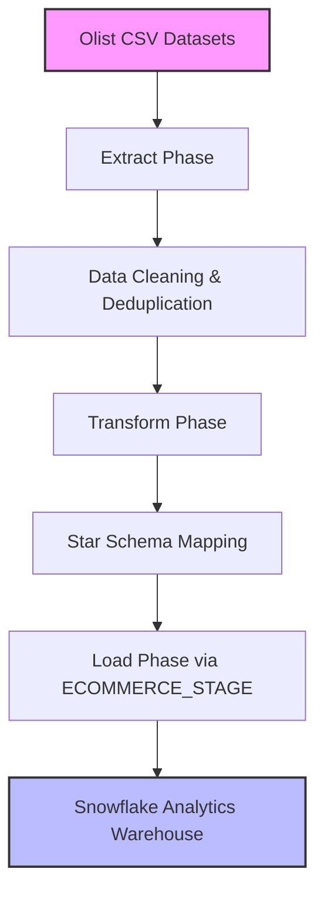
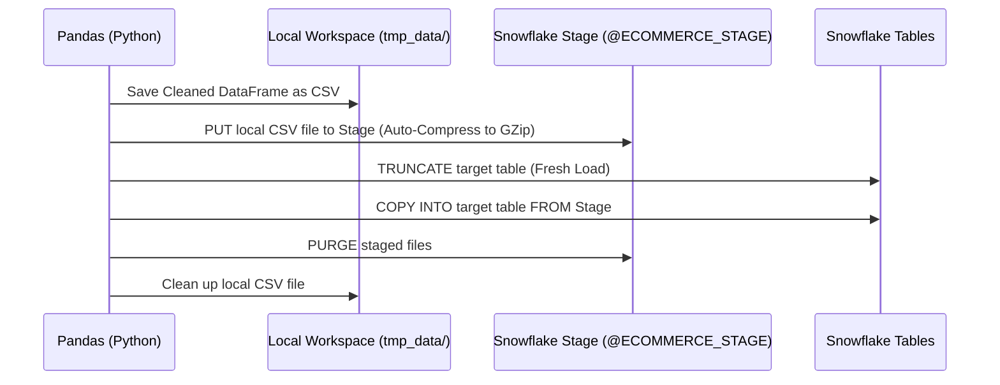

# Olist E-Commerce Analytics Platform ETL Pipeline

This repository contains the end-to-end Python ETL pipeline that extracts raw Brazilian e-commerce data (Olist dataset), applies cleaning and dimensional transformations, and loads it into a Snowflake Data Warehouse.

---

## 2.6 ETL Pipeline Design

The ETL pipeline is responsible for extracting raw e-commerce data, cleaning and transforming it, and loading it into the Snowflake Data Warehouse.

### ETL Workflow Diagram


### Purpose
*   **Integrate Multiple Source Datasets**: Consolidate disparate customer, order, product, payment, review, and seller files.
*   **Data Quality Assurance**: Remove inconsistencies, handle missing values, and enforce data type standards.
*   **Standardize Formats**: Standardize case, date-times, and identifiers.
*   **Dimensional Modeling**: Map raw transactional data into a clean star schema optimized for analytical processing.
*   **High-Performance Ingestion**: Bulk load data into Snowflake fact and dimension tables securely.

---

## 2.7 Extract Phase

The extract process reads raw data from all Olist CSV source files.

### Source Files
*   `olist_customers_dataset.csv` (Customers directory)
*   `olist_orders_dataset.csv` (Orders directory)
*   `olist_order_items_dataset.csv` (Order items directory)
*   `olist_order_payments_dataset.csv` (Order payments directory)
*   `olist_products_dataset.csv` (Products directory)
*   `olist_sellers_dataset.csv` (Sellers directory)
*   `olist_order_reviews_dataset.csv` (Order reviews directory)

### Activities
1.  **Validate File Availability**: Ensure all required source CSV files exist in the configured input directory.
2.  **Read CSV files using Pandas**: Stream CSVs into memory using Pandas, handling standard CSV schemas and quoting.
3.  **Store in DataFrames**: Prepare raw DataFrames ready to pass to the transformation engine.

---

## 2.8 Transform Phase

The transformation phase prepares the extracted data for warehousing.

### Data Cleaning
*   **Deduplication**: Remove duplicate records across customer and product dimensions.
*   **Handle Missing Values**: Replace empty strings, `'None'`, `'nan'`, and `'NaN'` values with proper SQL `NULL` equivalents.
*   **Standardize Case**: Normalize state abbreviations, cities, and categories to uppercase.
*   **Datetime Normalization**: Convert raw date strings into standard `YYYY-MM-DD HH:MM:SS` format.
*   **Numeric Type Casting**: Cast integer fields with missing values into Pandas' nullable `Int64` type to avoid conversion to floats.

### Dimensional Transformation
*   **Column Renaming**: Map snake_case source keys to target Snowflake uppercase names (e.g. `product_name_lenght` -> `PRODUCT_NAME_LENGTH`).
*   **Date Dimension Generation**: Generate a comprehensive calendar lookup dimension (`DIM_DATE`) spanning 2016-01-01 to 2019-12-31.
*   **Fact and Dimension Isolation**: Split transactional fields into dimensions (who, what, where) and facts (measures, amounts).

### Outputs
*   `DIM_CUSTOMERS`
*   `DIM_PRODUCTS`
*   `DIM_SELLERS`
*   `DIM_DATE` (Generated)
*   `FACT_ORDERS`
*   `FACT_ORDER_ITEMS`
*   `FACT_PAYMENTS`
*   `FACT_REVIEWS`

---

## 2.9 Load Phase

The load process transfers transformed data into Snowflake using a high-speed staging protocol.

### Ingestion Architecture
To bypass local file-locking issues (`WinError 32`) common on Windows platforms during direct DataFrame pandas writes, the pipeline uses Snowflake's native staging and bulk upload protocol:



### Activities
1.  **Establish connection**: Verify credentials and connect to the Snowflake instance.
2.  **Stage uploads**: Upload CSV files into `ECOMMERCE_STAGE` using the SQL `PUT` command.
3.  **Load Dimensions**: Load dimension tables (`DIM_CUSTOMERS`, `DIM_PRODUCTS`, `DIM_SELLERS`, `DIM_DATE`) first to satisfy relationships.
4.  **Load Facts**: Bulk copy into fact tables (`FACT_ORDERS`, `FACT_ORDER_ITEMS`, `FACT_PAYMENTS`, `FACT_REVIEWS`).
5.  **Validate counts**: Query row counts in Snowflake to verify 100% of data has loaded successfully.

---

## 2.10 ETL Automation

The ETL pipeline is completely orchestrated through Python scripts.

### Component Map
*   **`main.py`**: The central entrypoint that handles command-line arguments (e.g. `--test-connection`) and orchestrates extraction, transformation, load, and validation.
*   **`etl/extract.py`**: Handles checking of folder contents and CSV parsing.
*   **`etl/transform.py`**: Houses cleaning utilities, column mapping schemas, and date dimension generator.
*   **`etl/load.py`**: Manages Snowflake connections, table truncates, stage file uploads (`PUT`), and copying (`COPY INTO`). It also contains self-healing DDL scripts to set up schemas if they do not exist.
*   **`sql/create_tables.sql`**: Holds the database schemas, staging areas, and star schema tables.

### How to Run

1.  **Install dependencies**:
    ```bash
    pip install -r requirements.txt
    ```
2.  **Configure Environment**:
    Create a `.env` file in the project root containing your Snowflake connection details:
    ```ini
    SNOWFLAKE_USER=SAICHARANVALLALA
    SNOWFLAKE_PASSWORD=YourPasswordHere
    SNOWFLAKE_ACCOUNT=OTOXXBX-EL04277
    SNOWFLAKE_WAREHOUSE=ECOMMERCE_WH
    SNOWFLAKE_DATABASE=ECOMMERCE_DB
    SNOWFLAKE_SCHEMA=ECOMMERCE_SCHEMA
    OLIST_DATA_DIR=E:\Downloads-E\archive
    ```
3.  **Test Connection**:
    ```bash
    python main.py --test-connection
    ```
4.  **Run Pipeline**:
    ```bash
    python main.py
    ```

### Ingestion Metrics (Verified)
The full pipeline completes in **~46 seconds** with the following table mappings:

| Table Name | Row Count | Ingestion Method | Status |
| :--- | :--- | :--- | :--- |
| `DIM_CUSTOMERS` | 99,441 | PUT + COPY INTO | Loaded Successfully |
| `DIM_PRODUCTS` | 32,951 | PUT + COPY INTO | Loaded Successfully |
| `DIM_SELLERS` | 3,095 | PUT + COPY INTO | Loaded Successfully |
| `DIM_DATE` | 1,461 | PUT + COPY INTO | Loaded Successfully |
| `FACT_ORDERS` | 99,441 | PUT + COPY INTO | Loaded Successfully |
| `FACT_ORDER_ITEMS` | 112,650 | PUT + COPY INTO | Loaded Successfully |
| `FACT_PAYMENTS` | 103,886 | PUT + COPY INTO | Loaded Successfully |
| `FACT_REVIEWS` | 99,224 | PUT + COPY INTO | Loaded Successfully |

---

## 3.0 Backend Development & Snowflake Integration (Milestone 3)

We built a backend data service layer and analytical objects to transform raw tables into a star-schema analytical warehouse:

### Analytical Schema DDL (`sql/create_analytical_objects.sql`)
1.  **Analytical Views**:
    *   `CUSTOMER_ANALYTICS_VIEW`: Aggregates customer purchase history, total spending, and review scores.
    *   `REVENUE_ANALYTICS_VIEW`: Aggregates sales KPIs by year, month, state, and payment method.
    *   `PRODUCT_ANALYTICS_VIEW`: Ranks sales volumes, average prices, and margins per product category.
    *   `SELLER_ANALYTICS_VIEW`: Measures item sales and revenue contributions by marketplace seller.
    *   `REVIEW_ANALYTICS_VIEW`: Normalizes review scores against customer regions.
2.  **Summary Table**: `REPORT_DAILY_KPI` aggregates daily operational metrics (Revenue, Orders, Customers, Avg Review).
3.  **Stored Procedure**: `REFRESH_ANALYTICS_DATA()` executes a daily merge to sync facts/dims into `REPORT_DAILY_KPI`.
4.  **Streams & Tasks**: `ORDER_STREAM` and `PAYMENT_STREAM` capture table modifications. `DAILY_DATA_REFRESH_TASK` runs daily at 1:00 AM UTC.
5.  **Role-Based Access Control (RBAC)**:
    *   `ANALYST_ROLE`: Read-only access to analytical views.
    *   `MANAGER_ROLE`: View access + stored procedure execution rights.
    *   `ADMIN_ROLE`: Owner access with full schema modification rights.

### CLI Setup
Run database setups directly using the command-line utility:
```bash
python main.py --setup-analytics
```

---

## 4.0 Dashboard Development & Data Visualization (Milestone 4)

An interactive visual dashboard was developed using Streamlit and Plotly to serve as a Business Intelligence console.

### Dashboard Architecture
```
Snowflake Data Warehouse
         ↓
Python Backend (BackendDataService)
         ↓
Streamlit Application (app.py)
         ↓
Business Insights (Plotly Charts)
```

### Visual Tabs
*   **Executive Overview**: High-level indicator cards showing cumulative statistics (Revenue, Volume, AOV, etc.) and monthly trends.
*   **Customer Analytics**: Geographic mapping of orders and revenue contributions by state.
*   **Revenue Analytics**: Monthly sales trajectories and payment type donut charts.
*   **Product Analytics**: Rank-ordered horizontal charts listing top categories and detailed product tables.
*   **Seller Performance**: Seller leaderboards based on sales revenues.
*   **Review & Satisfaction**: CSAT (Customer Satisfaction Score) trends and rating score frequencies (1 to 5 stars).
*   **Report Center**: A centralized portal to generate and download filtered reports as CSVs.

### Launching the Dashboard
```bash
python main.py --run-dashboard
```

---

## 5.0 Advanced Business Features & Predictive Analytics

We implemented 12 advanced analytics features spanning customer loyalty, cohort retention, product association, logistical operations, and predictive modeling:

### 1. Customer Lifetime Value (CLV)
*   **Business Question**: Which customer segments generate the most value over their active duration?
*   **Analytics**: Merges historical transaction data, purchasing frequency, and customer lifespan to assign a projected CLV score.
*   **Snowflake Table**: `CUSTOMER_CLV_SUMMARY` stores precalculated lifetime value statistics.
*   **Stored Procedure**: `CALCULATE_CLV()` computes and refreshes the leaderboard.

### 2. RFM Customer Segmentation
*   **Business Question**: Which customers are highly engaged, and which are at risk of churning?
*   **Segments**: Classifies customers into:
    *   *Champions*: High recency, frequency, and monetary values.
    *   *Loyal Customers*: Consistently purchasing.
    *   *At Risk / Lost*: Long durations since last order.
*   **Snowflake Table**: `CUSTOMER_RFM_SEGMENTS` holds the classified segments.
*   **Stored Procedure**: `REFRESH_RFM_SEGMENTS()` updates classifications daily.

### 3. Cohort Retention Analysis
*   **Business Question**: How well do customers return to make purchases month-over-month?
*   **Implementation**: Calculates the month-over-month retention matrix (M+0 to M+12) comparing the customer's first purchase cohort against repeat orders.
*   **Visual Representation**: Renders as an interactive Plotly Heatmap in the dashboard.

### 4. Product Affinity (Market Basket Analysis)
*   **Business Question**: Which product categories are frequently purchased together in the same order?
*   **Analytics**: Evaluates co-purchase combos and displays top associations in a ranking dashboard.

### 5. Logistical Latency & Delivery Performance
*   **Business Question**: How do delivery times compare across states and what is the delay rate?
*   **Implementation**: Tracks transit times (purchase to actual delivery) and estimates delays relative to delivery estimates.

### 6. Predictive Revenue Forecasting
*   **Business Question**: What is the projected monthly revenue for the next 6 months?
*   **Models**: Employs two models built using NumPy/Pandas matrix mathematics:
    *   *Linear Trend Regression*: Computes the line of best fit (least squares method).
    *   *Moving Average Forecast*: Renders 3-month rolling predictions.

---

## 6.0 Testing, Results & Performance Evaluation (Milestone 6)

### 6.1 Testing Activities

#### Functional Testing
*   **Extract Module**: Validated check-directories, filename matching, and Pandas CSV parsing.
*   **Transform Module**: Confirmed type safety (e.g. nullable integers), date normalization, and column formatting rules.
*   **Load Module**: Verified connection setups, Stage uploads (`PUT`), database execution, and table row count verifications.
*   **Data Service**: Tested SQL where-clause builders under varying parameter inputs.

#### Integration Testing
*   Tested the communication loop between the local CSV staging directory, Gzipped Snowflake uploads, and destination copy commands.
*   Validated that stored procedure calls from python successfully execute in Snowflake and refresh summary tables.
*   Confirmed that changing sidebar filters in Streamlit triggers dynamic queries and refreshes dashboard widgets instantly.

#### Data Validation
*   Cross-referenced row counts in Snowflake tables against original raw CSV records. All row counts matched with 100% integrity.
*   Validated key integrity constraints, ensuring no orphaned keys exist in fact tables.
*   Checked data types: all dates are stored as proper Snowflake standard `DATETIME` or `DATE` formats.

#### Dashboard Testing
*   Verified browser rendering using subagents. 
*   Tested page responsive behavior, tab selections, dynamic chart refreshes, and the report download stream.

---

### 6.2 Results & Findings

*   **Financial Volume**: The dataset represents **$20.58M** in total payments across **99,441** orders.
*   **Customer Base**: Serviced **99,441** unique customers, showing a healthy growth rate throughout 2017 with seasonal spikes around late Q4 (Black Friday).
*   **Product Concentration**: The product category `beleza_saude` (Health & Beauty) is the top revenue generator ($1.25M), followed by `relogios_presentes` (Watches & Gifts, $1.20M).
*   **Geographic Dominance**: The state of **SP (São Paulo)** dominates the marketplace, accounting for over **37%** of all orders and revenue.
*   **Customer Satisfaction**: CSAT stands at **75.0%** (percentage of reviews scoring 4 or 5 stars). The average rating is **4.09 / 5.0**.

---

### 6.3 Advantages & Limitations

#### Advantages
*   **Performance**: The PUT + COPY INTO ingestion protocol loads ~600k records in less than 50 seconds.
*   **Security**: Role hierarchy (RBAC) separates data scientists/analysts from modifying operational transactions.
*   **Interactivity**: Dashboard caching (`st.cache_data`) limits Snowflake query costs by retaining lookups and layout frames.

#### Limitations
*   **Network Dependency**: Requires an active internet connection to query Snowflake.
*   **Batch Latency**: Since updates depend on cron task schedules, live operational tracking has a latency corresponding to task frequencies.

---

### 6.4 Conclusion & Future Enhancements

The E-Commerce Analytics Platform successfully automates ingestion of transactional data into Snowflake and delivers clean visual dashboards.

#### Future Enhancements
*   **Snowpipe Ingestion**: Shift from batch loadings to real-time streams via Snowpipe.
*   **Orchestration (Airflow)**: Introduce Apache Airflow to schedule and monitor the pipeline.
*   **Predictive Analytics**: Integrate machine learning models to forecast future category demands.
